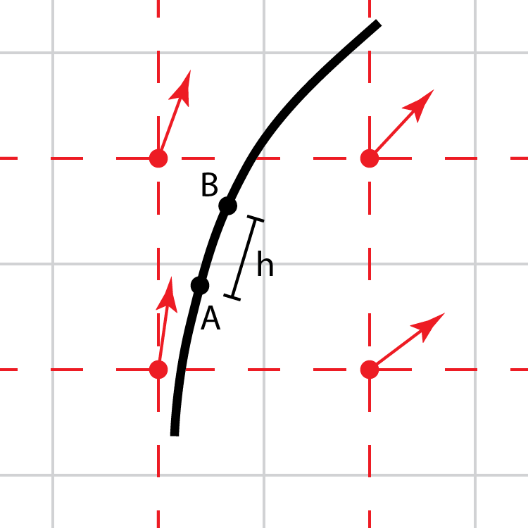
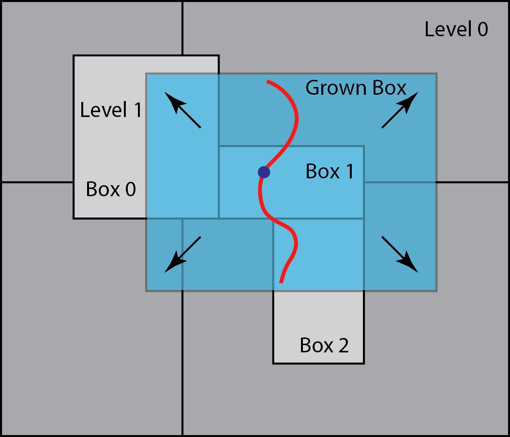

.. highlight:: bash

partStream
**********

Given a plotfile containing a vector field and an MEF file containing
a collection of "seed" points, create "streamlines" eminating from the
seed points that are locally parallel to the vector field.  The
resulting streamlines will be of a fixed length going both directions
along the vector field from the seed point unless `cSpace=1`, where 
streams have the same length in progress variable space. Additionally,
scalar fields from the plot file can be mapped onto the streamslines. 
Results can be written in a number of different formats, as discussed below.

custom plotfile-like data folder, which is discussed in the data section.
These files cannot be directly visualized with standard plotfile tools.

Usage: ::

   ./partStream2d.gnu.MPI.ex plotfile=<string> isofile=<string> 
   
Example: ::
  
   ./partStream2d.gnu.MPI.ex ./IOnputSamples/partStreams.inp 
   

   
Tool Options
############

Seed points
~~~~~~~~~~~

::

   #------------------- SEED POINTS ----------------------------------------------------------
   oneSeedPerCell = 0                         # [0, 1], DEF: 0; If 1, places one particle in each cell. Can get very expensive/large for 3D files.
   isoFile = plt00000_surf.mef                # DEF: None; If provided, places one particles in each node of the surface.
   seedLoc = 0.1 0.0 0.3                      # DEF: None; If provided, places a single particle in the given location.
   seedRakeNum = 10                           # DEF: None; If provided, places seedRakeNum evenly spaced seed points along a line segment between two endpoints seedRakeL and seedRakeR.
   seedRakeL = 0.0 0.0 0.0                    # Left endpoint for seedRake. Requires AMREX_SPACEDIM real.
   seedRakeR = 0.5 0.5 0.5                    # Rigth endpoint for seedRake. Requires AMREX_SPACEDIM real.

Streamlines are computed to emanate from seed points specified by the
user. Currently, there are four options to initialize the seed points:

1. `oneSeedPerCell` initializes one particle per uncovered cell. Can get very expensive/large for 3D files.
2. If a triangulated surface or polyline is used (by passing the name of the MEF file via the `isoFile` keyword), the resulting streamlines retain the connectivity inferred by the input structure. And since the steamlines will not, in general, cross they will bound a triangular-prism shaped volume extending a distance from the surface on either side. The union of these volumes tile a layer around the original triagulated surface.  In 2D, the streamlines will bound a polygonal structure that similarly tiles the region around the original polyline.
3. `seedLoc` allowes to initialize a seed in a specific location, specified via the coordinates of a single seed point provided to `seedLoc`.
4. `seedRakeNum` places `seedRakeNum` evenly spaced seed points along a line segment between two endpoints `seedRakeL` and `seedRakeR`.

Integration options
~~~~~~~~~~~~~~~~~~~

::

   #------------------- INTEGRATION OPTIONS --------------------------------------------------
   Nsteps = 400                               # DEF: 50; Number of steps in each direction. Length of stream will be 2*Nsteps-1.
   hRK = 0.1                                  # DEF: 0.1; Step size in physical length, given as fraction onf the finest level cell size.
   cSpace = 0                                 # [0, 1], DEF: 0; If 1, steps are equidistant in cSpace.

Figure :numref:`fig:stream:RK4` illustrates a streamline (in black)
that is computed from a vector field, whose components are specified
on cell centers.  The paths are integrated in both directions from the
seed point, as depicted in :numref:`fig:stream:RK4`.  The user
specifies the interval, :math:`h`, as a fraction, `hRK`, of the grid
spacing at the finest level of vector field used, as well as the total
number of such intervals, `nRK`.

.. raw:: latex

   \begin{center}

.. _fig:stream:RK4:

   Streamlines (in black) are computed by integrating the vector field
   from a seed point in intervals of :math:`h`, e.g., from point A to
   B, using the RK4 scheme. The vector field components are defined at
   the nodes of the dual grid connecting the cell centers and are
   linearly interpolated.

.. raw:: latex

   \end{center}

Algorithm details
~~~~~~~~~~~~~~~~~

::

   #------------------- INPUT CONTROL -------------------------------------------------------
   infile = plt00000                          # Plot file for particle stream construction
   vectorField = Y(H2)_gx Y(H2)_gy Y(H2)_gy   # Names of gradient vector components.
   vars = I_R(H2)                             # Variables to map on the streams
   #------------------- GRID CONTROL ---------------------------------------------------------
   finestLevel = 1                            # DEF: finest level of plot file; Sets the finest level to read.
   is_per = 1 1 0                             # Sets case periodicity
   nGrow = 1                                  # DEF: 1; Grow cells.

The algorithm starts by determining the finest AMR level box in the
plotfile (indicated by the keyword, `infile`) that contains the
physical location of each seed point (up to and including the level
indicated by the keyword, `finestLevel`).  Then, as the required
plotfile data is read (in parallel), a distribution map will be
created for each level, and we use this to assign the processor that
will be responsible for computing the streamline associated with that
point. The vector field is defined via the specified names in `vectorField`.
Additionally, the variables specified in `vars` will be interpolated onto the computed streams.

The RK4 scheme is used to integrate the vector field, :math:`u`, along streamline
for a distance :math:`h` from A to B (see Figure :numref:`fig:stream:RK4`):

.. math::

    x_{B} =& \;x_{n} + \frac{1}{6} \big( k_1 + 2 k_2 + 2 k_3 + k_4\big)\\
    &k_1 = h \, u(x_{A}), \;\; x_{1} = x_{A} + 0.5 k_{1}\\
    &k_2 = h \,u(x_{1}),  \;\; x_{2} = x_{A} + 0.5 k_{2}\\
    &k_3 = h \,u(x_{2}),  \;\; x_{3} = x_{A} +     k_{3}\\
    &k_4 = h \,u(x_{3})

The vector field :math:`u` is defined at cell-centers and we need to
construct a function that, given the vector field data at nodes, is
able to linearly interpolate these components as needed to evaluate
the above expressions. A simple way to orchestrate this interpolater is
to base it on source data that lives on a logically rectangular,
uniformly space grid, as this allows simple/fast "mod" operations to
locate the specific source data indices for the interpolation.

.. note::
   The following section is probably deprecated.

However, if the seed point starts off, for example, near the boundary
of the owning box, it is possible that the integration will eventually
step off the grid, and possibly across AMR levels, before reaching the
required path length, and thus attempt to access data that is
unavailable to this processor.  A simple solution follows the usual
AMReX approach in these situations - grow cells.  Given the `hRK` and
`nRK` parameters, we can compute the size of a grow region buffer that
is guaranteed to fully contain the path - even if it is rather large -
see Figure :numref:`fig:stream:Grow`.  And given the standard AMReX
fill-patching infrastructure, we can fill the required data locally
from the plotfile classes, being careful to account for periodic and
physical domain boundaries.

.. raw:: latex

   \begin{center}

.. _fig:stream:Grow:

   A streamline (red) is generated from the seed point (blue), which
   is owned by Box 1 in the finest level here, Level 1.  The
   streamline goes beyond the valid region of Box 1.  Data to fill the
   grown box is copied from neighboring grids at the same refinement
   level, and interpolated from coarse levels where needed.
   
.. raw:: latex

   \end{center}

Note that because the size of the grow region needed depends on the
maximum length of the streamlines, these patches can be quite large,
particularly in 3D.  However, this approach is far simpler than any
method that might move between levels and/or processors whenever
boundaries are crossed.  In order to manage very large datasets, this
tool has been written to run in parallel with MPI. For maximum
flexibility, there is also a separate tool that can read the
streamline generated with the above strategy, and interpolate a set of
fields onto the streamlines.

Output formats
~~~~~~~~~~~~~~

::

   #------------------- OUTPUT CONTROL -------------------------------------------------------
   outfile = plt00000                         # DEF: infile; Name base of putput files
   writeParticles = 0                         # [0, 1], DEF: 0; Write particles as plt file (Not sure how this looks in the end.)
   particlefile = plt00000_particles          # DEF: outfile + "_particles"; Name of writeParticles output file/dir
   writeStreams = 0                           # [0, 1], DEF: 0; Write streamlines in Tecplot ascii format.
   streamfile = plt00000_stream               # DEF: outfile + "_stream"; Name of writeStreams output file/dir
   writeStreamBin                             # [0, 1], DEF: 0; Write streamlines as binary.
   streamBinfile = plt00000_streamBin         # DEF: outfile + "_streamBin"; Name of writeStreamBin output file/dir

.. note::

   When ``writeParticles`` is enabled, the particle plotfile is written through the AMReX particle I/O layer, whose data-file count is controlled by the native ``particles.particles_nfiles`` option (read directly by AMReX) rather than the ``n_files`` option used by the grid-based tools.

