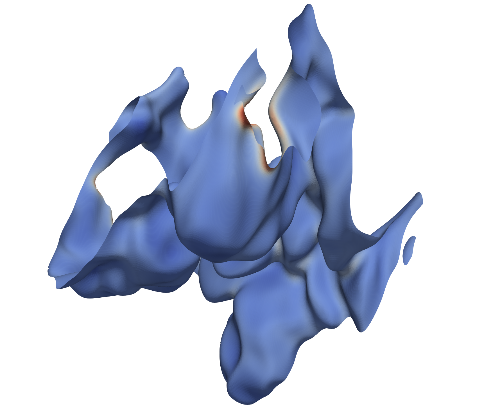
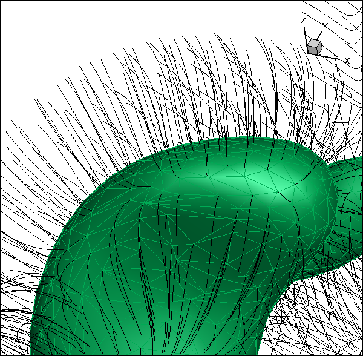

.. highlight:: bash

Data Structures
***************

There are a number of data structure formats used within the
``PeleAnalysis`` suite of codes.  Some are basic AMReX types, such as
``MultiFab`` or ``plotfiles``, while others are specific to the
diagnostics and cannot be represented naturally in AMReX's containers
that were generally created for block-structured data.  Here, we
provide an overview of the data structures used by the various tools,
both how they are (currently) written to disk and how they are used in
the analysis tools.

Plotfiles
---------

Plotfiles are the standard format for reading data from a Pele
simulation. Their format is discussed in the `AMReX documentation
<https://amrex-codes.github.io/amrex/docs_html/IO.html>`_. For a
multi-level AMR calculation, a plotfile contains an ASCII ``Header``
file and one subfolder for each refinement level.  There may also be a
folder containing multilevel particle data, and other
application-specific files (build information, typical state values,
run input parameters, etc). Each refinement level contains one or more
``MultiFab`` file sets (including an ASCII header file and a number of
data files, numbered sequentially).  The main ``Header`` file includes
a list of variable names written to the structure, some details about
the domain and refinement data and specific run status, and a mapping
for which ``Multifab`` files in the level subfolders contain each of the
plotfile variables.

The analysis codes read plotfiles from disk into memory using one of
two AMReX-provided C++ classes: ``PlotFileData`` or ``AmrData``.  The
former is the more recently developed of the two, and has a simple
interface for reading and interpolating data from the plotfiles into
local temporaries used to build diagnostics.  The ``AmrData`` object
is somewhat more limited in terms of interface to interpolations, etc,
but has the significant advantage of allowing for demand-driven data
reads - that is, only the plotfile metadata is read from disk when the
``AmrData`` object is instantiated; the data is read only as needed to
satisfy a ``FillVar`` request - and then it is read at the granularity
of component and box. A ``FlushGrids`` operation is available to
dynamically manage memory used by the ``AmrData`` object.  This
functionality can be critical when processing extremely large datasets
on massively parallel machines. In the set of analysis codes in this
repository, either may be used depending on the application for which
the tool was developed. They can also be rather trivially converted,
as needed.

Note that many of the processing tools read plotfiles as input,
derive fields that live on the grid structure of the plotfile, and
write results out as new plotfiles.  There are a number of tools one
can use to subset plotfiles in space and component indices and to
join together multiple plotfiles (with some limitations on the compatibility
of the level and grid structures).

``FArrayBox`` and ``MultiFab``
------------------------------

All of the usual AMReX data structures are, of course, available in
the analysis tools, and are used extensively.  These structures are
documented in the `AMReX documentation
<https://amrex-codes.github.io/amrex/docs_html/Basics_Chapter.html>`_.
Normally, these structures are used as recommended in the AMReX
documentation and application codes.  However, as discussed below,
there are operations that these structures support which we have
"hijacked" for our own purposes.  In particular, ``FArrayBox`` and
``MultiFab`` can be read and written to disk in a format that is
somewhat "self-describing".  Floating point data is managed in a
portable way and the commands to interact with the IO are particularly
convenient/simple. Thus, when we need to read or write data, and it
happens to be structured in a way that makes use of these containers,
we use them...even if we have to "cheat" to do it!

MEF - Marc's Element Format
---------------------------

An ``MEF`` file is an example of (ab)using the AMReX IO functions for
the ``FArrayBox``.  An ``MEF`` file is the on-disk representation of
an unstructured data set, which is inherently not supported in the
native AMReX data structures.  An unstructured dataset contains a
number of named components at a set of implicitly numbered "nodes",
and then a set of integer sets that identify an oriented list of nodes
to connect for each "element". An ``MEF`` file makes use of the IO
operations of ``FArrayBox`` in order to collect together into a single
file all the data associated with the unstructured data. Examples
where an ``MEF`` structure is used include triangulated surfaces (such
as those that result from the isovalue contouring operations in 3D)
and polylines (or segment sets that represent contours of 2D data).  A
limitation of the ``MEF`` format is that all elements must have the
same number of nodes, and all nodes must have the same number of
components (in the same ordering).  Also, we typically assume the
first ``AMREX_SPACEDIM`` components contain the spatial coordinates.
On disk, the MEF file is a concatenated set of information containing:
a label, the variable names, the number of nodes per element, the
number of elements, followed by a dump of the ``FArrayBox`` used to
store the nodes, followed by an ASCII write of the elements. At the
moment, the IO of the unstructured datasets is done explicitly by each
tool that needs them (we should probably encapsulate this into a class
that manages this part...TODO).  Two other notes are that the node
numbering in an MEF file starts at 1 (rather than 0) by convention,
and the ``FArrayBox`` used to manage the nodes is built on an AMReX
``Box`` object that has its first component running from 0 to
``Nnodes-1``, and its 1:``AMREX_SPACEIM-1`` extents running from 0 to
0.  Thus, one does not want to treat this special ``Box`` or
``FArrayBox`` in the normal AMReX way (intersections in index space
will NOT give the user what is expected!). Visualization of these data
structures using standard AMReX tools will also give perhaps
unexpected results (there are conversion tools to generate VTK VTP-format
files from ``MEF`` files for reading into Paraview, e.g.  See the
figure below).  The special ``Box`` and ``FArrayBox`` objects
used with ``MEF`` files are typically created on-the-fly for the sole purpsoe of IO
operations. Outside of IO, the data is typically moved into structures
that more clearly indicate usage.

   : An isotherm of a flame-in-a-box case, where the surface is
   colored by the concentration of a flame intermediate species.
   This was created as an ``MEF`` file from the ``isosurface.cpp``
   tool, then converted from ``MEF`` to ``DAT`` (Tecplot ASCII
   data), then from ``DAT`` to ``VTP`` using the included
   python script, `datToVTP.py`, and imported into Paraview).

   
Many of the analysis routines that interact with the unstructured
datasets need to work in parallel (with MPI).  Typically, when that
is done, each rank has a local node numbering. However, the ``MEF``
format does not have a parallel counterpart, so all IO is typically
done via the IO rank, and thus requires an explicit aggregation and
node number rationalization step (which, again, is done explicitly
in the codes, and probably ought to be encapsulated into a class
or something to ease use - TODO).

Several of the diagnostic tools interact with ``MEF`` structures.  They
are used to represent isosurfaces of 3D data, polylines that are
isolines of 2D plotfile data, and isolines of 3D surface data.  Although
they are generally used for node-centered data, the structures can
be (ab)used to represent data that is element-centered.  This is
done by duplicating the data at the nodes of each triangle, including
its position, but setting the values of the other components for all
nodes in the element to the elemental value.  This is the strategy
used, for example, to represent an element-averaged value of a quantity
(or even values of integrated quantities over stream tubes - discussed
below). The (brute force) writing of an ``MEF`` to a ``std::ofstream os``
looks like this:

.. highlight:: c++

::

      os << label << std::endl;
      os << vars << std::endl;
      os << nElts << " " << nodesPerElt << std::endl;
      nodefab.writeOn(*os);
      os.write((char*)eltVec.dataPtr(),sizeof(int)*eltVec.size());

``StreamData``
--------------

``StreamData`` is a class whose design sorta follows the ``MEF``
ideas.  The format was generated to represent "streamline data" in 2-
and 3-space, and is fundamentally unstructured in nature.  Imagine you
have a cloud of point locations that you would like to use to seed the
generation of integral paths along a vector field.  For example,
imagine the points are the nodes of an isotherm that defines a "flame",
and that from each node we construct a path along the
integral curves of the temperature gradient, into both the hot and
cold sides of the surface.  The connectivity of the triangles on the
seed surface can be used to define a connectivity of prism-shaped
elements that tile a subregion of the domain between the hot and cold
ends of the integral curves.

   : An isotherm from a flame calculation, where the triangles defining the surface
   are visible.  The black paths follow integral paths from the surface nodes. Note
   that the integral curves do not cross.  As they are constructed from the 3D plotfile,
   any quantity defined in the plotfile can be interpolated to these paths.  Also,
   a number of operations can be defined on the curved elements defined by extension of
   the surface triangles along these paths - e.g., these can define local "flamelets".

The representation of this data in memory is quite complex.  Each
streamline consists of a set of points, and each point has a location
and any number of quantities that have been interpolated from the
source plotfile data. Additionally, we want to preserve the
connectivity of the surface that implies the connectivity of the
curved prism-shaped elements that tile the volume of space surrounding
the seed surface.

Because stream data can be quite large, the structures are inherently
parallel, and make extensive use the ``MultiFab`` and its parallel IO
capabilies.  Each line contains the original seed point, which falls
into the valid ragion of a box from the finest level of the plotfile
that contains that point. The ``Box`` associated with this region of
space and refinement level is deemed the "owner" of the stream
line. The data associated with the stream is stored in an
``FArrayBox`` associated with the ``MultiFab`` at the level of the
owning ``Box``.  The special ``Box`` of the owning ``FArrayBox`` is
created over the bounds ``(0:Nlocal,-Npts:Npts,0)``, where ``Nlocal``
is the number of seed points owned by this box, and ``Npts`` is the
number of points on the stream line towards each direction from the
surface (``j=0`` is on the seed surface).  The ``FArrayBox`` created
on this ``Box`` object has ``Ncomp`` components, including position
coordinates and any number of fields interpolated from the source
plotfile.  The data is distributed with the same distribution map used
to distribute the field data when the plotfile is read (determined by
the analysis code, NOT the original simulation).  Any ``Box`` in the
``BoxArray`` at each level in the stream data that do not contain
stream lines are set to a default (invalid) size, marking to the
analysis code that there are no stream lines there to process.
Much like the temporaries used in IO of ``MEF`` data, the ``MultiFab``
structures associated with stream data should not be treated like normal
AMReX data structures - visualization and manipulation of the data
requires detailed knowledge of their layout.

On disk, the ``StreamData`` object looks much like a plotfile.  There
is an ASCII ``Header`` file, and subfolders for each AMR level.
Within the subfolders, there are ``MultiFab`` files associated with
the stream line data, possibly written in parallel across multiple
data files, etc.  Additionally, there is a text file that specifies
the connectivity of the elements. Presently, these structures are
written, brute force, by the analysis codes (see the function
``write_ml_streamline_data`` in ``stream.cpp``, for example).  The
functionality has been lifted in to a ``StreamData`` class, but the
analysis tools haven't yet been ported to use these class - TODO.

N-dimensional bins
------------------

Many of the analysis tools generate bins of data.  These bins
typically are used to create joint probability density functions
(jPDFs) in 1, 2 or higher dimensions. They are also used to condition
statistics as an intermediate step to generating jPDFs.  2D jPDFs are
somewhat special in that we typically assume constant bin widths in
each coordinate so that an ``FArrayBox`` is a natural container to use
to hold the result.  Also because of the IO capabilities of this
class, it is a natural candidate for a format on disk.  However,
an ``FArrayBox`` is a simple container, and has no notion of axes
labels, variable names, bin sizes, etc.  Thus, whenever we are
generating this type of data, there is an inherent complexity in how
to represent the final output data to enable plotting and
interpretation of the results.  Note that the analysis tools here DO
NOT include plotting routines, so there has to be an understanding
about how to communicate all these details to the end user (such as
``xmgrace`` or ``matlab``, etc).  To date, we have not come up with a
sufficiently flexible, self-describing way to convey all this
information, so the tools typically dump everything one needs and the
person orchestrating the plots must manually assemble the necessary
information.

A particularly noteworthy case is the ``binMEF`` tool, which bins the
data in an arbitrary number of coordinates.  For each coordinate, the
user determines the min, max and number of bins, and the input data
``MEF`` file that represents a surface to be chopped up.  The code
proceeds through each coordinate, and each bit of area landing in a
particular bin for coordinate ``n``, is then chopped up into bins of
coordinate ``n+1``.  This can be used to generate an area-weighted
jPDF in multiple coordinates, but can also be used as a conditioning
tool to exclude parts of the surface satisfying certain criteria
(falling outside the bins defined for that coordinate).  Given the
array of bins, the result can be represented as a floating point
number (the area) and an array of integers, one for each of the
binning coordinates. Just like the simpler 2D jPDF example above, the
end user plotting or analyzing the results of this tool must assemble
all the bin info in their plotting package of choice.  For the
N-dimensional case however, it is rarely useful to store the data as a
dense N-space container.  The results are written to the screen in
their naturally sparse format.  We haven't yet developed a
standardized way to communicate all these details, so the process can
be tedious, but it is unavoidable.

