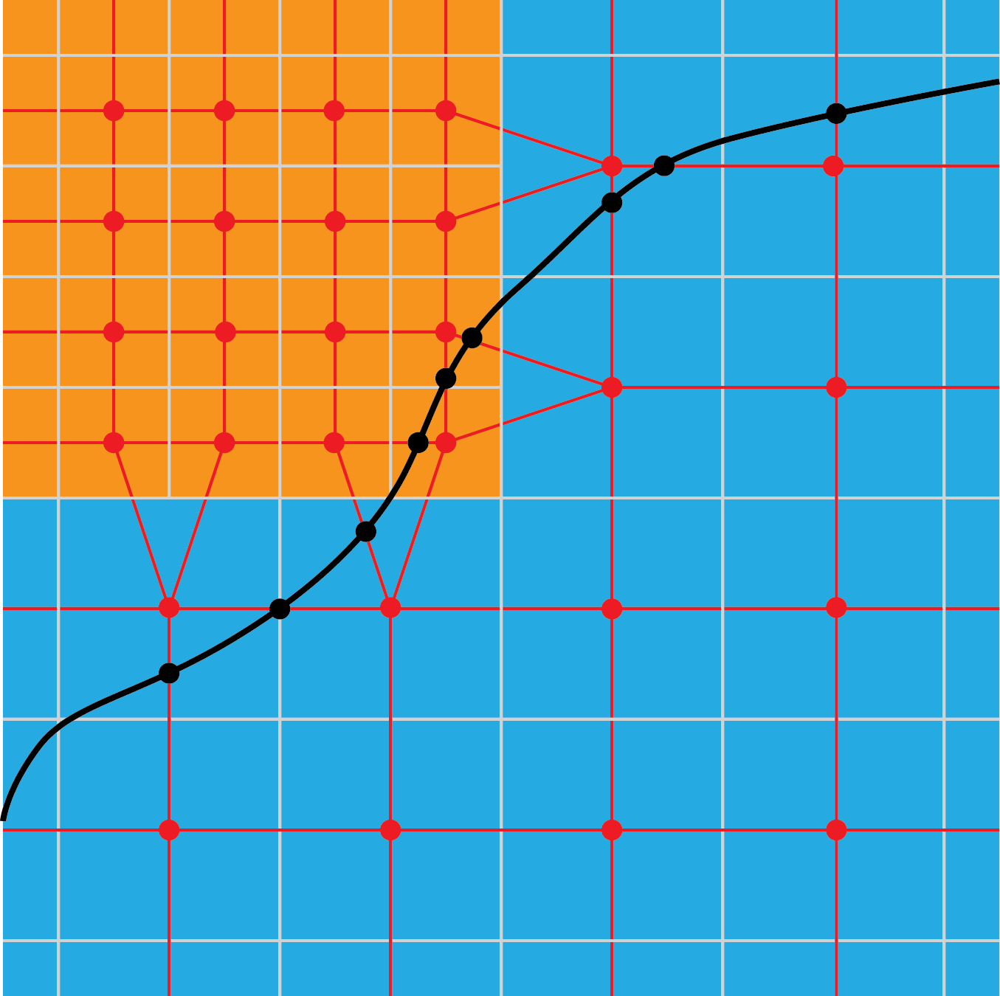

.. highlight:: bash

******************************************
isosurface - Isosurface of plotfile scalar
******************************************

Create isosurfaces (contours) from a component in a plotfile, given
the name of the variable and a value.  The result is written as an MEF
(Marc's element file). In 2D, the contour segments are connected up
into a minimal set of polylines before writing. Optionally, map other
variables to surface, and optionally compute signed distance from this
surface onto the cell-centered mesh of the plotfile.

::

  Usage:
    ./isosurface2d.gnu.MPI.ex inputs infile=<s> isoCompName=<s> isoVal=<v> [options] 
	Options:
	     infile=<s> where <s> is a pltfile
	     isoCompName=<s> where <s> is the quantity being contoured
	     isoVal=<v> where <v> is an isopleth value
	     Choosing quantities to interp to surface: 
	       comps=int comp list [overrides sComp/nComp]
	       sComp=start comp[DEF->0]
	       nComp=number of comps[DEF->all]
	     finestLevel=<n> finest level to use in pltfile[DEF->all]
	     writeSurf=<1,0> output surface in binary MEF format [DEF->1]
	     outfile=<s> name of tecplot output file [DEF->gen'd]
	     build_distance_function=<t,f> create cc signed distance function [DEF->f]
	     rm_external_elements=<t,f> remove elts beyond what is needed for watertight surface [DEF->t]

Details
#######

Computing the isosurface requires building a "flattened" representation of the AMR data structure that ignores
covered data, and properly connects cells across coarse-fine interfaces. Once we have a watertight representation of the surface, we make use of the marching squares (in 2D) or marching cubes (3D) strategy to build a watertight contour based on intersections of the surface with the dual grid (see Figure :numref:`fig:isosurface:dual`).

.. raw:: latex

   \begin{center}

.. _fig:isosurface:dual:

   In 2D, the isocontour (in black) is computed from the dual grid
   created by connecting cell centers.  Even with multiple AMR levels the
   dual grid is composed on quads (hexes in 3D), but at the coarse-fine
   interfaces, some of the nodes are degenerate.  Intersections between
   the isocontour and the quad element boundaries are computed by linear
   interpolation between the scalar values of the nodes at either end of
   the segment.  The contour segments (or triangles) are obtained by
   connecting these intersections across the elements.

.. raw:: latex

   \end{center}

The isosurface code contains the following steps:

1. Use AMReX-provided class ``PlotFileData`` to load `isoCompName` field data, and ``FillPatchTwoLevels`` to fill grow cells, including those across periodic boundaries.
2. The location of each valid cell center is computed using :math:`\Delta x` at that level.  The grow cells are set to have all their locations at the center of the coarse cell outside, and the grow data is filled with piecewise constant interpolation. The effect is that the coarse and fine levels are joined in a water-tight way using degenerate quads/hexes, that actually look in 2D either like a triangle (a degenerate quad) or a trapezoid (depending on whether the two grow cells are in the same coarse cell or adjacent ones (see Figure :numref:`fig:isosurface:dual`).
3. Intersections of the isosurface with these element constructs is computed by searching each pair of adjacent nodes around the outside of the polygon for a sign change of (value - isoVal).  When such a condition is found, the location of the intersection is computed by linear interpolation, and the desired additional variables are mapped to the same point.  The result is stored as a pair<Edge,Point>, where Edge is a pair of IntVects defining the endpoints of the segement that is intersected and their associated Amr level ID, and the Point contains the coordinates first, then any other mapped/interpolated variables at that node.  The intersection structs are stored in a map of these pairs, allowing exact comparisons for unique nodes with no floating point comparison issues.
4. Elements on the surface are described as an ordered vector of these iterators into a master map for this rank.
5. Portions of the surface intersecting each valid grid are computed in parallel, and collated onto a single MPI rank. Multiply defined nodes (those with the same pair of IntVect/AmrID) are eliminated and a global numbering of the unique set is created; the element list is merged and the numbering is reconciled.
6. The map representation of the surface is converted to a simple surface representation and written to disk by a single processor.

Signed distance function
########################

Optionally, the code can also return a field containing the signed distance to the isosurface from each valid point in the plotfile structure.  The shape of this data will correspond to that of the original plotfile.  The signed distance is computed, up to a maximum, on all points in the domain.
