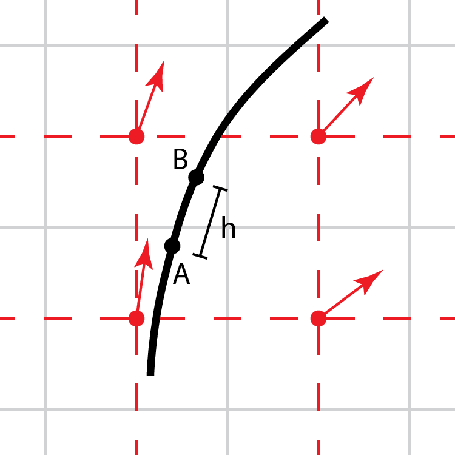
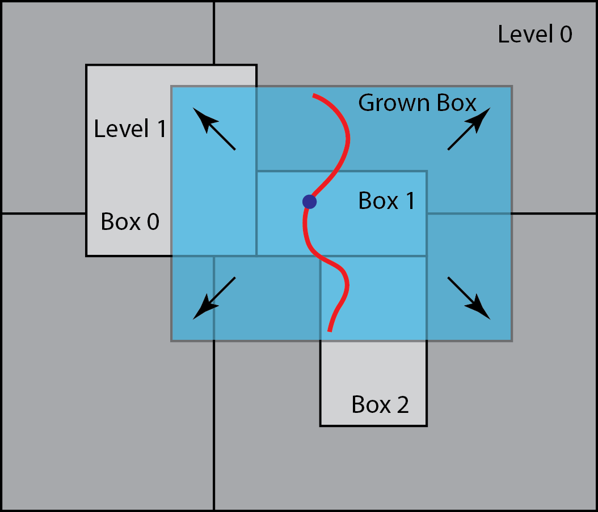

.. highlight:: bash

***************************************
stream - Streamlines of plotfile vector
***************************************

Given a plotfile containing a vector field and an MEF file containing
a collection of "seed" points, create "streamlines" eminating from the
seed points that are locally parallel to the vector field.  The
resulting streamlines will be of a fixed length going both directions
along the vector field from the seed point.  Results will be written in a
custom plotfile-like data folder, which is discussed in the data section.
These files cannot be directly visualized with standard plotfile tools.

::

   Usage:
      ./stream2d.gnu.MPI.ex plotfile=<string> [options] 
	Options:
            isoFile=<string>  OR  seedLoc=<real real [real]
            streamFile=<string>  OR  outFile=<string>
            is_per=<int int int> (DEF=1 1 1)
            finestLevel=<int> (DEF=finest level in plotfile)
            progressName=<string> (DEF=temp)
            traceAlongV=<bool> (DEF=0)
            buildAltSurf=<bool> (DEF=0)
                (if true, requires altVal=<real>, also takes dt=<real> (DEF=0) and altIsoFile=<string>)
            nRKsteps=<int> (DEF=51)
            hRK=<real> (DEF=.1 (*dx_finest in plotfile)
            nGrow=<int> (DEF=4)
            bounds=<float * 4> (DEF=NULL)

Options
#######

Seed points
***********

Streamlines are computed to emanate from seed points specified by the
user. The seed points can be defined as the nodes of a triangulated
surface (in 3D) or a "polyline" (2D), or can be specified directly in
the ParmParsed input.

If a triangulated surface or polyline is used (by passing the name of
the MEF file via the `isoFile` keyword), the resulting streamlines
retain the connectivity inferred by the input structure.  And since
the steamlines will not, in general, cross they will bound a triangular-prism
shaped volume extending a distance from the surface on either side.  The union of these
volumes tile a layer around the original triagulated surface.  In 2D, the
streamlines will bound a polygonal structure that similarly tiles the
region around the original polyline.

If the seed points are specified directly in the input, no connectivity
information is inferred. Currently, the only option for this mode is
accessible via the `seedLoc` keyword, which specifies the coordinates
of a single seed point.

Integration options
*******************

Figure :numref:`fig:stream:RK4` illustrates a streamline (in black)
that is computed from a vector field, whose components are specified
on cell centers.  The paths are integrated in both directions from the
seed point, as depicted in :numref:`fig:stream:RK4`.  The user
specifies the interval, :math:`h`, as a fraction, `hRK`, of the grid
spacing at the finest level of vector field used, as well as the total
number of such intervals, `nRK`.

.. raw:: latex

   \begin{center}

.. _fig:stream:RK4:

   Streamlines (in black) are computed by integrating the vector field
   from a seed point in intervals of :math:`h`, e.g., from point A to
   B, using the RK4 scheme. The vector field components are defined at
   the nodes of the dual grid connecting the cell centers and are
   linearly interpolated.

.. raw:: latex

   \end{center}

Vector field
************

Currently, the vector field can be constructed to align with the gradient of a scalar
field, or with the flow velocity (if the option `traceAlongV = t`). If the the velocity
field is not used, the required components of the gradient vector field (identified
via the keyword, `progressName`) are computed on the fly with second-order centered
differences.

Alt surface
***********

If the keyword `buildAltSurf = t`, a new triangulated surface is constructed after the
streamlines are generated. This surface will be created where the scalar identified as
`progressName` takes the value specified by the keyword, `altVal` along the streamlines.
The connectivity of this surface will be identical to the connectivity of the original
surface (specified with the keyword, `isoFile`).  The new surface is written to the
file indicated by the keyword, `altIsoFile`.

Algorithm details
*****************

The algorithm starts by determining the finest AMR level box in the
plotfile (indicated by the keyword, `plotfile`) that contains the
physical location of each seed point (up to and including the level
indicated by the keyword, `finestLevel`).  Then, as the required
plotfile data is read (in parallel), a distribution map will be
created for each level, and we use this to assign the processor that
will be responsible for computing the streamline associated with that
point.

The RK4 scheme is used to integrate the vector field, :math:`u`, along streamline
for a distance :math:`h` from A to B (see Figure :numref:`fig:stream:RK4`):

.. math::

    x_{B} =& \;x_{n} + \frac{1}{6} \big( k_1 + 2 k_2 + 2 k_3 + k_4\big)\\
    &k_1 = h \, u(x_{A}), \;\; x_{1} = x_{A} + 0.5 k_{1}\\
    &k_2 = h \,u(x_{1}),  \;\; x_{2} = x_{A} + 0.5 k_{2}\\
    &k_3 = h \,u(x_{2}),  \;\; x_{3} = x_{A} +     k_{3}\\
    &k_4 = h \,u(x_{3})

The vector field :math:`u` is defined at cell-centers and we need to
construct a function that, given the vector field data at nodes, is
able to linearly interpolate these components as needed to evaluate
the above expressions. A simple way to orchestrate this interpolater is
to base it on source data that lives on a logically rectangular,
uniformly space grid, as this allows simple/fast "mod" operations to
locate the specific source data indices for the interpolation.

However, if the seed point starts off, for example, near the boundary
of the owning box, it is possible that the integration will eventually
step off the grid, and possibly across AMR levels, before reaching the
required path length, and thus attempt to access data that is
unavailable to this processor.  A simple solution follows the usual
AMReX approach in these situations - grow cells.  Given the `hRK` and
`nRK` parameters, we can compute the size of a grow region buffer that
is guaranteed to fully contain the path - even if it is rather large -
see Figure :numref:`fig:stream:Grow`.  And given the standard AMReX
fill-patching infrastructure, we can fill the required data locally
from the plotfile classes, being careful to account for periodic and
physical domain boundaries.

.. raw:: latex

   \begin{center}

.. _fig:stream:Grow:

   A streamline (red) is generated from the seed point (blue), which
   is owned by Box 1 in the finest level here, Level 1.  The
   streamline goes beyond the valid region of Box 1.  Data to fill the
   grown box is copied from neighboring grids at the same refinement
   level, and interpolated from coarse levels where needed.
   
.. raw:: latex

   \end{center}

Note that because the size of the grow region needed depends on the
maximum length of the streamlines, these patches can be quite large,
particularly in 3D.  However, this approach is far simpler than any
method that might move between levels and/or processors whenever
boundaries are crossed.  In order to manage very large datasets, this
tool has been written to run in parallel with MPI. For maximum
flexibility, there is also a separate tool that can read the
streamline generated with the above strategy, and interpolate a set of
fields onto the streamlines.
